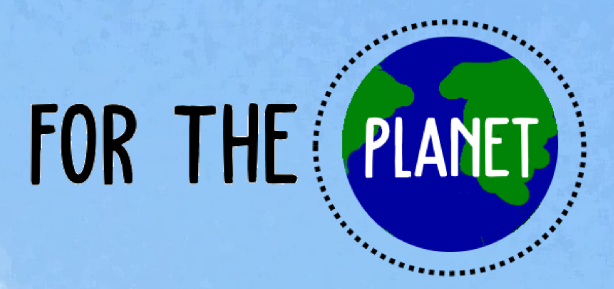

# For the Planet

_For the Planet_ is a Collective Risk Dilemma (CRD) game focusing on climate change. 
Following the CRD convention, players try to avoid an environmental collapse, balancing their own **Economic Development** (their individual profit) – the private good which is affected only by a player's actions; with the shared **Environment State** – the public good which is affected by the actions of every player; both variables defined in the range [0, 1]. 

When the Environment State reaches 0.001, the game ends with an environmental collapse, and a collective loss (everyone loses). If the players survive for 20 rounds, the player with the highest economic development wins. This number of rounds was chosen because it was empirically determined to be enough to reveal differences in playstyles between profiles of players, and to create pressure to invest in the public good. Each round of the game is composed of four different phases:

1. The first phase of each round is the **Budget Allocation Phase**. In this phase, the players have 5 investment points that they need to allocate to either the Economic Development and/or Environment State. Information about other players’ budget allocations is hidden while the player completes this phase; 

2. After allocating their budget, players enter the **History Display Phase** where the values of all players' current allocations are displayed (thus, each player can perceive the cooperation level of each other player);

3. Next, players enter the **Investment Execution Phase**. This phase stochastically calculates the results of the players' investments. Increases are calculated by summing the values obtained from rolling as many six-sided dice as points allocated for each investment type (in Environment or Economic Development), diving the result by 100, and clamping it to the range [0, 1];

4. The last phase is the **Decay Simulation Phase**, which simulates a "natural" decay of the public and private goods. These decreases are calculated in the same fashion as investments increases, this time rolling nine dice for the Environment State decay, and three dice for the Economic Development decay of each player. Nine dice are rolled for the Environment State decay but only three dice for Economic Development decay because of the difference in size of the pool of possible investments. While the Economic Development decay balances the investment of one player, the Environment State decay balances the contributions of all the three players to the environment.

## Work developed by:
- Samuel Gomes - [@SamGomes](https://github.com/SamGomes)
- José Bernardo Rocha - [@jbgrocha](https://github.com/jbgrocha)

## Components were also developed, modified and adapted for several studies by:
- Guilherme Nogueira [@GuilhermeRNogueira](https://github.com/GuilhermeRNogueira)
- Filipa Correia - [@PipzCorreiaz](https://github.com/PipzCorreiaz)
- Samuel Mascarenhas - [@samuelfm](https://github.com/samuelfm)
- Silvia Tulli - [@Silviatulli](https://github.com/Silviatulli)
- Julien Charles-Nicolas - [@JuCN](https://github.com/JuCN)
- Justin GALLY - [@MrJuju97351](https://github.com/MrJuju97351)
- Diana Lopes - [@dianamlopes22](https://github.com/dianamlopes22)

